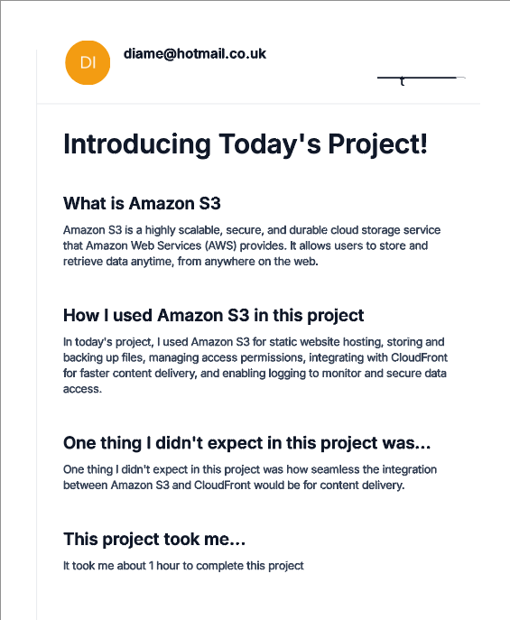
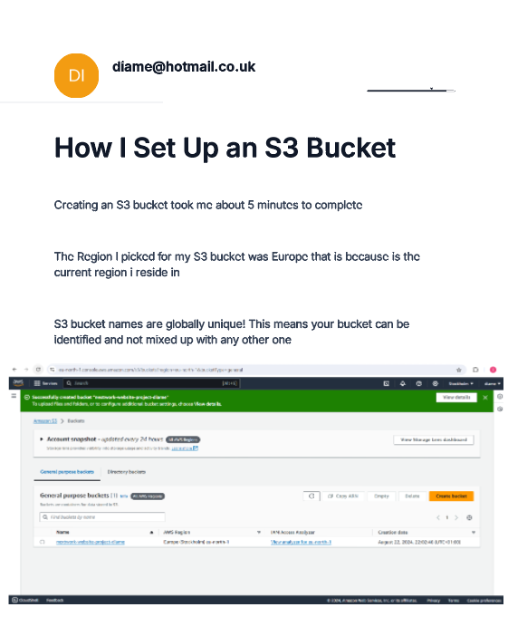
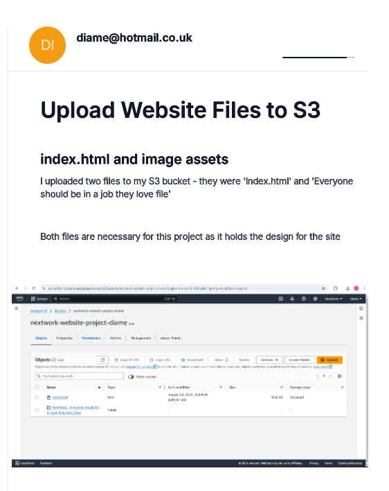
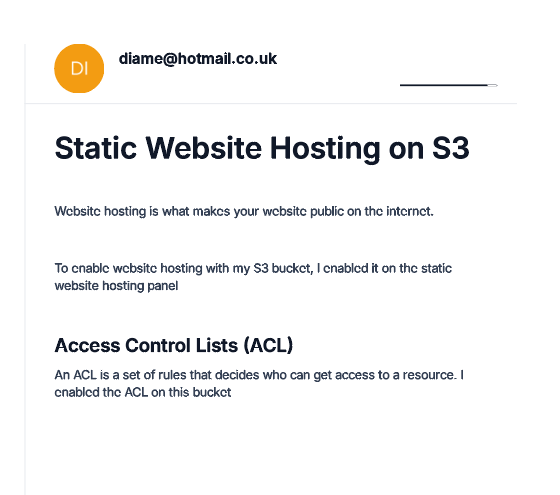
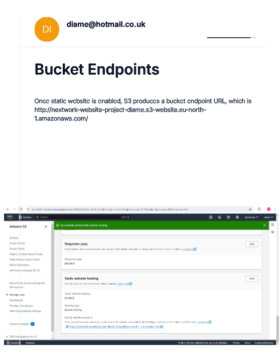
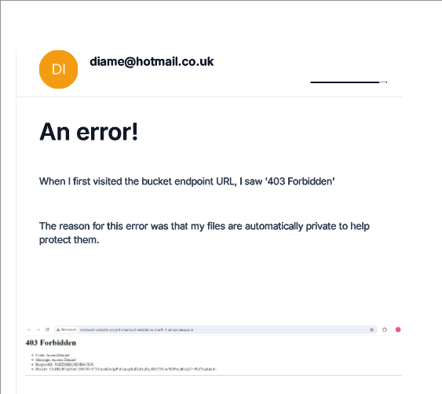
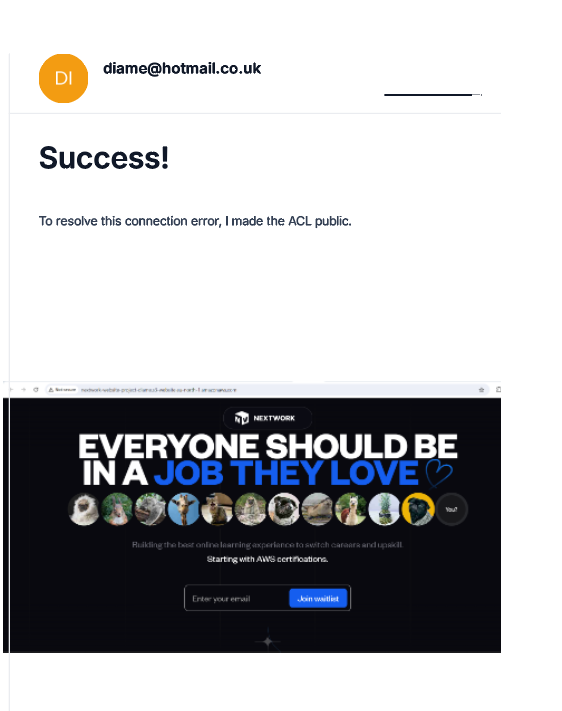

# Host-A-Website-On-Amazon-S3


<h2>Description</h2>
This repository contains the files for a static website hosted on Amazon S3. I set up an S3 bucket, enabled static website hosting, and uploaded the website files. The bucket is configured with the necessary permissions to make the site publicly accessible. Optionally, a custom domain can be linked using AWS Route 53.
<br />


<h2>Languages and Utilities Used</h2>

- <b>HTML, CSS, JavaScript</b> 
- <b>Amazon S3</b>
- <b>AWS CLI (Command Line Interface)</b>


<h2>Environments Used </h2>

- <b>Windows 10</b>
- <b>AWS Management Console</b>

<h2>Program walk-through:</h2>

<p align="center">

<br />
<br />

<br />
<br />

<br />
<br />

<br />
<br />

<br />
<br />

<br />
<br />

<br />
<br /> 
<!--
 ```diff
- text in red
+ text in green
! text in orange
# text in gray
@@ text in purple (and bold)@@
```
--!>
